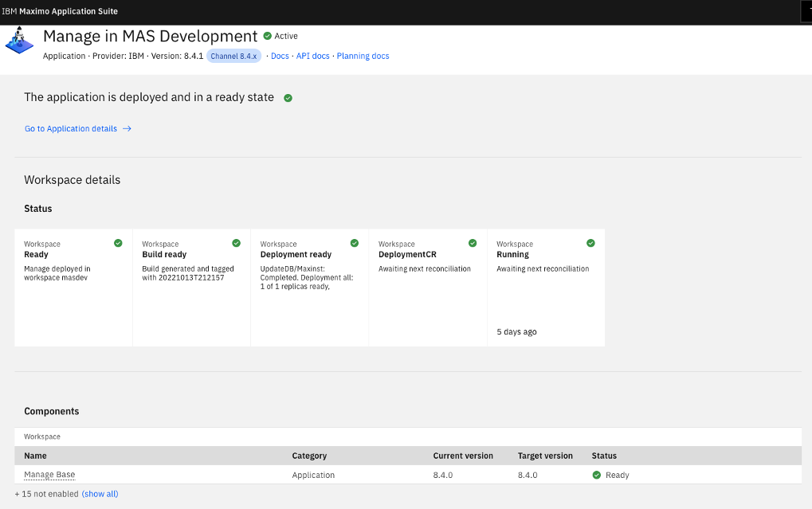
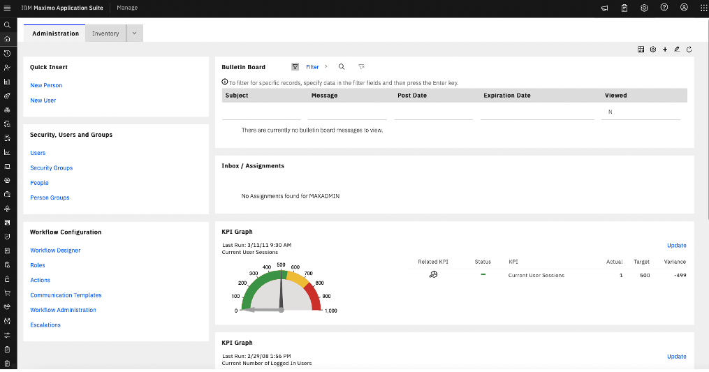

# Activate MAS Manage

MAS Manage is usually the first application you activate after MAS core has been installed. You can use 
the MAS admin control to activate it and other applications.

Alternatively, you can run an Ansible Playbook to create a DB2
Warehouse, configure database connection and activate MAS Manage all in
one step. Please refer to the document, "[Install Manage
Application](https://ibm-mas.github.io/ansible-devops/playbooks/oneclick-manage/)".

## Use MAS Admin Console

From the MAS console, select Workspace, activate "Manage" and deploy
"Optimizer". This process can take some time.



When the activation is completed, the workspace and Manage show "Ready".

Next, create a new user or reset password for an existing user such as
"maxadmin". Then log out the admin account.

## Launch MAS Manage

You can find the web URL for the Manage application using the oc command
or from the OpenShift cluster console.

- Run the oc command: 

```
oc get routes -n \<install instance id\>-manage
```

- From the cluster console, navigate to Networking, select the
    namespace \<install instance id\>-manage, and click on Routes.

To access the Manage application, add /maximo to the end of the route,
or replace "manage" with "home" in the URL without adding "/maximo".

```
https://masdev.manage.\<install instance id\>.apps.\<cluster
name\>.gcp.mydomainxxx.com/maximo

https://masdev.**home**.\<install instance id\>.apps.\<cluster
name\>.gcp.mydomainxxx.com

```

Log in with a user account using the revised URL. Click on the
Applications icon (9 dots) at upper right corner. Select Manage to see
the dashboard.

