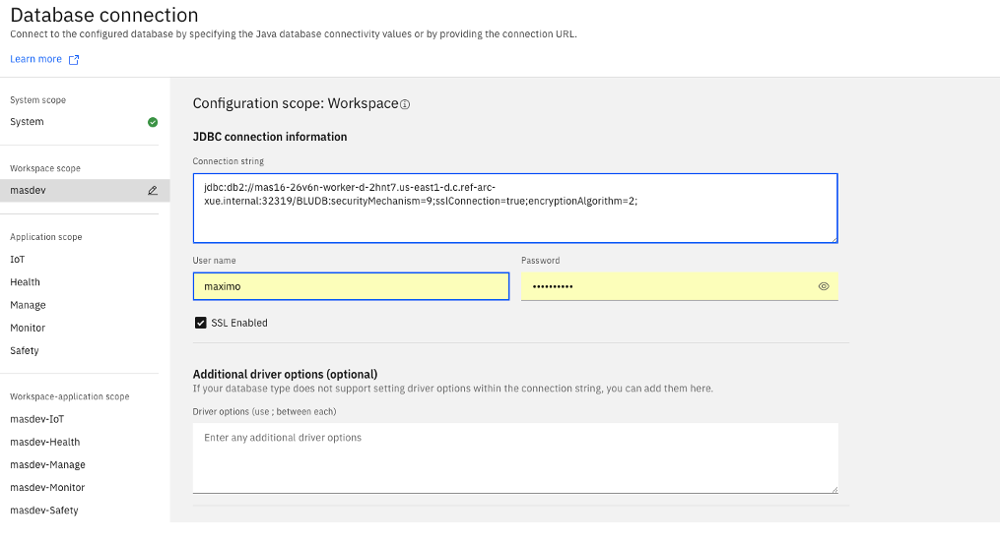

# Install IBM Cloud Pak for Data

Maximo Application Suite (MAS) requires database to store data using IBM
DB2, DB2 Warehouse, or other supported types of databases. To use IBM DB2 or DB2
Warehouse, you can deploy IBM
Cloud Pak for Data (CP4D) which includes DB2 and DB2 Warehouse. Alternatively, 
you can install DB2 or DB2 Warehouse directly.

## Use Daffy to install CP4D

To install CP4D version 4.5.x or higher, you can use Daffy. For other installtion options, you can refer to the document,
"[Installing Cloud Pak for
Data](https://www.ibm.com/docs/en/cloud-paks/cp-data/4.5.x?topic=installing)."

Add two environment variables to the same xxx-env.sh file that you use to install OpenShift.

```
CP4D_VERSION="4.5.3"
CP4D_ENABLE_SERVICE_DB2_WAREHOUSE=true
```

Run the command line in the /data/daffy/env folder. Note that the cp4d
folder is used.

```
/data/daffy/cp4d/build.sh <replace with cluster name here without
"-env.sh">
```

During the build process, Daffy runs the command to apply two storage
classes.

```
/data/daffy/tmp/cpdcli/cpd-cli-linux-EE-11.0.0-20/cpd-cli manage apply-cr \
--components=cpfs,scheduler,cpd_platform \
--release=4.5.0 \
--cpd_instance_ns=cpd-instance \
--block_storage_class=ocs-storagecluster-ceph-rbd \
--file_storage_class=ocs-storagecluster-cephfs \
--license_acceptance=true
```

When the installation is completed, which takes approximately 1 hour and
45 minutes or longer, you are provided with the following CP4D control
plane login information.

Here is the login info for the CP4D Navigator console*

```
################################################################
Super User: admin
Password: rvGcd27nHWRd
CP4D Web Console: https://cpd-cpd-instance.apps.<clustername>.gcp.mydomainxxx.com   
```

## Create DB2 Warehouse Instance

First, log in to the CP4D control plane and create a DB2 Warehouse
instance.


Follow the steps of the database instance creation from the portal:

-   Type: Select the DB2 Warehouse version installed.

-   Configure: For storage structure, select "Separate locations for all
    data". For production, select "Deploy database on dedicated nodes".

-   Advanced configuration: For workload, select "Operational
    Analytics".

-   System storage: Select the storage class, for example, "nfs-client".
    Choose the data size.

-   User storage: Select the storage class, for example, "nfs-client".
    Choose the data size. For access mode, select "ReadWriteOnce" or
    "ReadWriteMany".

-   Backup storage: Select the storage class, for example, "nfs-client".
    Choose the data size.

-   Transaction logs storage: Select the storage class, for example,
    "nfs-client". Choose the data size.

Create the database instance. Make a note of the host name and the JDBC
Connection URL (SSL).

```
jdbc:db2://\<CLUSTER_ACCESSIBLE_IP\>:32319/BLUDB:user=-;password=\<password\>;securityMechanism=9;sslConnection=true;encryptionAlgorithm=2
```


Click the "Download SSL Certificate" button to download the certificate.
You will need the info when configuring the database connection for MAS.

Create a new user, for example "maximo" and assign both the
"administrator" and "user" roles to it.

## Create Database Schema for Manage

Configure DB2 Warehouse and create MAS schema by running a set of
scripts. Please refer to the document, "[Configuring Db2
Warehouse](https://www.ibm.com/docs/en/maximo-manage/continuous-delivery?topic=deployment-configuring-db2-warehouse)".

## Configure Database Connection

Next, log into the MAS console and select the Administration page (the
gear icon) at upper right corner. Select Configuration from the
navigation menu on the left side of the page. You can configure database
connection at the System level, Workspace level and other levels or
scopes. Please refer to the document, "[Configuration
Settings](https://www.ibm.com/docs/en/mas85/8.5.0?topic=administering-configuring-suite)".

To configure database connection for the workspace, select the workspace
name, for example "masdev". Copy and paste the connection string you
noted from the previous step. Remove the user and password from it.
Replace CLUSTER_ACCESSIBLE_IP with the host name from the previous step.

```
jdbc:db2://\<hostname\>:32319/BLUDB:securityMechanism=9;sslConnection=true;encryptionAlgorithm=2;
```

Enter the user credentials you created at the previous step. Open the
certificate you downloaded, copy and paste the text to the Certificates
box and confirm/save it. Save the connection string. It takes a few
minutes to update the connection string in MAS.




[Back to ReadMe page](../README.MD)