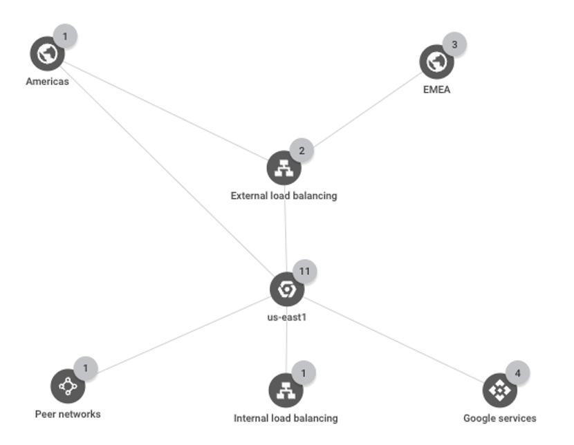
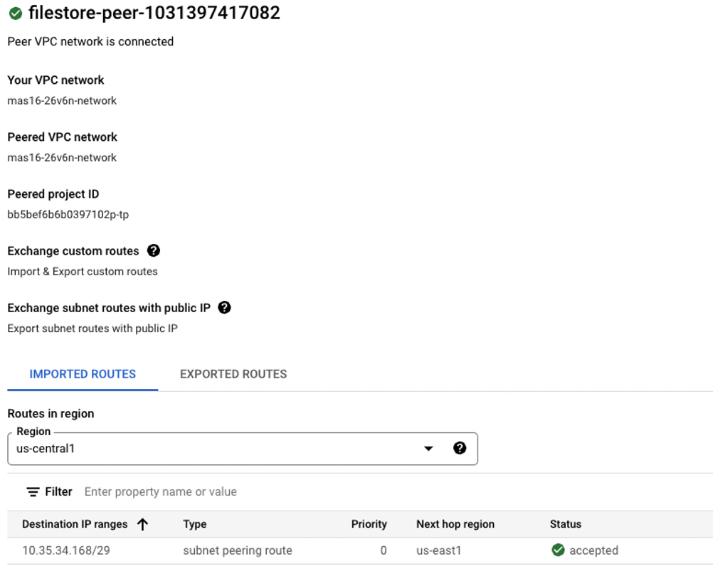

# Use NFS Server backed Storage for OpenShift

Red Hat has re-branded OpenShift Container Storage (OCS) as Red Hat Open
Data Foundation (ODF) since OpenShift 4.9 was released in 2021. While
use of ODF, currently in technical preview on GCP, is the storage path
going forward, a network file server (NFS) is a viable option for
applications requiring support for "Read Write Many" (RWX) storage mode,
for example, attached documents in Maximo. One benefit with NFS backed
storage is that applications and APIs off the OpenShift cluster can
access the shared storage when adequate permissions are granted. Refer
to Red Hat [OpenShift Data
Foundation](https://www.redhat.com/en/technologies/cloud-computing/openshift-data-foundation)
for more details.

## Create a Filestore Instance

You can create an NFS server in your GCP project from the cloud console
or using the gcloud command line. From the cloud console, search for
"Filestore" and then create an instance.



Select the same VPC network for the cluster. Choose the instance type
(Basic, Enterprise, High Scale), storage type (HDD, SSD), and storage
capacity (ranging from 1TB to 64 TiB). For region and zone, select ones
that are in the same region and zone or close to your cluster. Enter the
file share name, and make a note it, along with the IP address for the
instance.

When the instance is created, a VPC network peering is automatically
created, which enables Filestore to access the VPC. On the other hand,
any Compute Engine VM or GKE cluster can access any Filestore instance
that's on the same VPC network. With the connectivity to the Filestore
the storage pods in OpenShift can read and write data it.



Filestore provides data encryption at rest and in transit, and comes
with two data recovery options, backups and snapshots. For high
availability, use Enterprise tier Filestore instances, which are
regional resources. Refer to GCP's [Filestore
documentation](https://cloud.google.com/filestore/docs/overview) for
more details.

## Deploy a Dynamic Provisioning Storage Class

Google Filestore is a fully managed storage service and more scalable
than one single NFS server. When the Filestore instance is created and
file share enabled, the NFS server is ready without any configuration.
You can use the IP address and file share name to create OpenShift
persistent volume claims (PVC) and persistent volumes (PV) directly.

However, to create storages dynamically, it's necessary to deploy a
storage provision provider. For that we use the opensource project,
"[Kubernetes NFS Subdir External
Provisioner](https://github.com/kubernetes-sigs/nfs-subdir-external-provisioner)."
NFS subdir external provisioner is an automatic provisioner that use
your existing and already configured NFS server to support dynamic
provisioning of PVs via PVCs. It is not recommended to use an [NFS
storage
provisioner](https://www.ibm.com/docs/en/mas-cd/continuous-delivery?topic=provisioner-setting-up-nfs-storage)
for workloads with heavy I/O performance requirements.

To deploy the storage provider, take the following steps, as outlined on
the [support](https://www.ibm.com/support/pages/how-do-i-create-storage-class-nfs-dynamic-storage-provisioning-openshift-environment)
web page:

1.  Copy or download the yaml files from the /deploy folder in the
    github repo -- class.yaml, deployment.yaml, rbac.yaml,
    test-claim.yaml and test-pod.yaml. Note that the namespace "default"
    is used in the files, but you can change it.

2.  Replace the namespace in the deployment.yaml file. Also, replace the
    value of PROVISIONER_NAME in the spec section and change it from
    "k8s-sigs.io/nfs-subdir-external-provisioner" to something else, for
    example, "nfs-storage-provisioner". Also, replace the IP address and
    file share path in the env section and the volumes section.

3.  Replace the namespace in the rbac.yaml file. The namespace appears
    in a few places so do a global search and replace.

4.  Log in to the cluster and run the command lines to create a
    namespace, for example "nfs", storage class deployment, the storage
    class, and role based access (rbac).

```
oc create namespace nfs
oc create -f deployment.yaml
oc create -f class.yaml
oc create -f rbac.*yaml
```

5.  Create a role based on "hostmount-anyuid" which allows to provision
    the storage and assign the role to the service account, for example,
    "nfs-client-provisioner", which is specified in the rbac.yaml file.
    More info on the role at "[Managing security context
    constraints](https://docs.openshift.com/container-platform/4.11/authentication/managing-security-context-constraints.html)."

```
oc create role use-scc-hostmount-anyuid --verb=use --resource=scc --resource-name=hostmount-anyuid -n nfs
oc adm policy add-role-to-user use-scc-hostmount-anyuid -nfs-client-provisioner --role-namespace nfs -n nfs
```

You can check the OpenShift cluster to make sure that the deployment is
successful. You can scale the deployment from the default 1 pod to 2 or
more.


You can create a PVC and a pod to test the storage class using
test-claim.yaml and test-pod.yaml files, or a sample yaml file that
includes PVC and pod in one file.

```
apiVersion: v1
kind: PersistentVolumeClaim
metadata:
  name: test-nfs-provisioner
  namespace: nfs
spec:
  storageClassName: nfs-client
  accessModes:
- ReadWriteMany
  resources:
requests:
      storage: 10Mi
apiVersion: v1
kind: Pod
metadata:
  labels:
run: ubuntu
  name: ubuntu-test-nfs
  namespace: nfs
spec:
  containers:
  - image: ubuntu
name: ubuntu
resources: {}
command: [“sleep”, “3600”]
volumeMounts:
      - mountPath: /nfs
        name: nfs-vol
  volumes:
- name: nfs-vol
      persistentVolumeClaim:
        claimName: test-nfs-provisioner
```

[Back to ReadMe page](../README.MD)