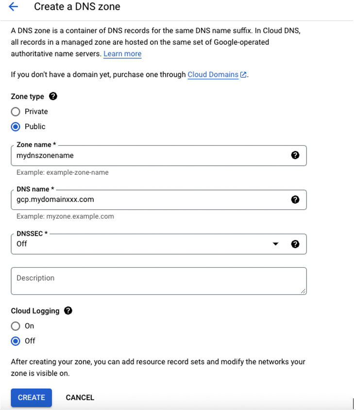
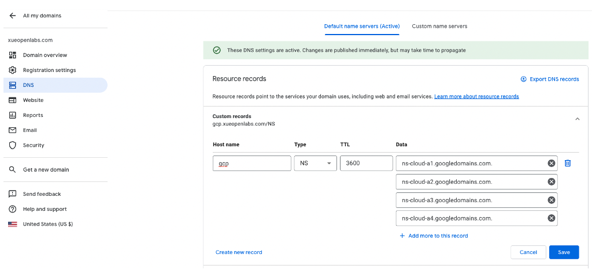

# Prerequisites

Before installing Red Hat OpenShift, you must complete and meet the
prerequisites.

## GCP Project, Service Account and Role Assignments

Create a project in your Google Cloud account and a service account with
within the project. Grant proper permissions to the service account and
enable a set of Google Cloud API services.

The following APIs must be enabled in your GCP project. You can enable
the API service using gcloud commands or from Google cloud console.

-   iam.googleapis.com

-   deploymentmanager.googleapis.com

-   compute.googleapis.com

-   cloudapis.googleapis.com

-   cloudresourcemanager.googleapis.com

-   dns.googleapis.com

-   iamcredentials.googleapis.com

-   servicemanagement.googleapis.com

-   serviceusage.googleapis.com

-   storage-api.googleapis.com

-   storage-component.googleapis.com

-   networksecurity.googleapis.com

The following roles must be assigned to the service account based on
OpenShift recommended security practices. If the service account is
assigned to the "owner" role instead of individual roles, which is not
recommended, you can install OpenShift.

-   compute.admin

-   iam.securityAdmin

-   iam.serviceAccountAdmin

-   iam.serviceAccountUser

-   iam.serviceAccountKeyAdmin

-   storage.admin

-   dns.admin

## Register a custom domain

One OpenShift requirement is to have a domain name. The domain name
along with its subdomains for APIs and apps are used to access the
OpenShift cluster console and applications including Maximo Application
Suite. You can purchase a domain through Google or other domain service
providers or use an existing domain name. Note that the domain name
registration is done in your Google account, which is separated from
your GCP account.

## Create a DNS zone in GCP

You can create a Cloud DNS zone in your GCP project. While not required,
you may use a subdomain for OpenShift clusters, for example,
gcp.mydomainxxx.com, leaving submains available for other uses.

After a DNS zone is created, one SOA record and one NS (name server)
record are added automatically. Make a note of the NS names, for example
"ns-cloud-a1.googledomains.com."

## Add DNS Name Servers in Domain Registration Account

In your Google domain account, select DNS from the navigation menu and
the "Default name servers" tab. Add a DNS record with the NS names you
obtained from your GCP DNS zone. Save the record.

[Back to ReadMe page](../README.MD)