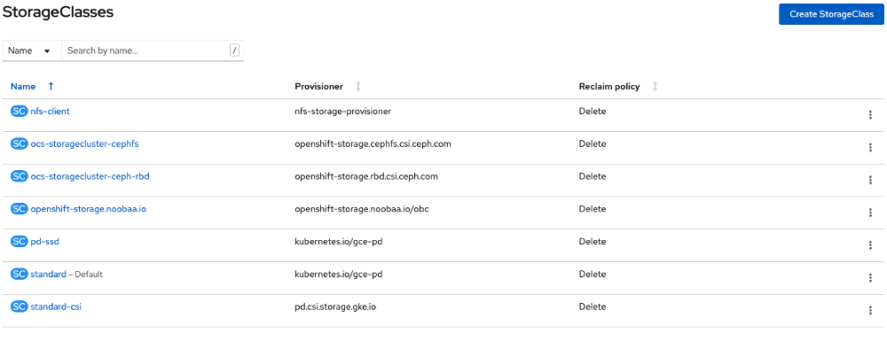
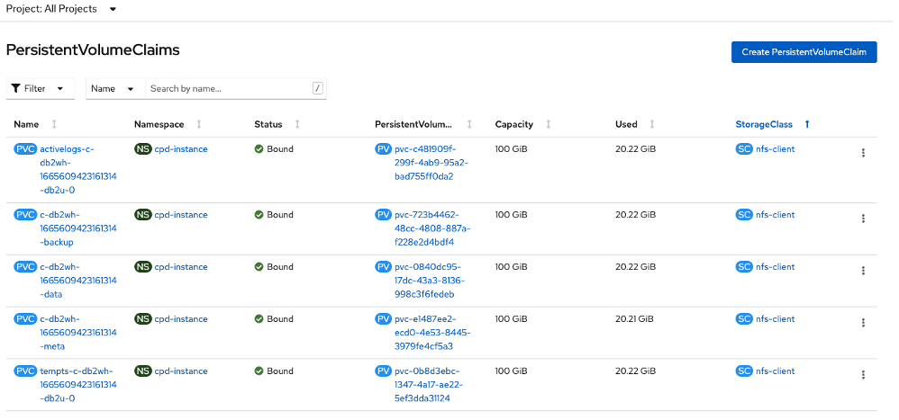

# Storage Considerations

OpenShift Data Foundation (ODF) is in technical preview on GCP and
therefore NFS backed storage is used to provide the RWX storage mode for
Maximo. In the test environment, the custom storage class, "nfs-client",
is used for Maximo only, whereas the built-in storage classes are used
for OpenShift.

## OpenShift Storage Classes

With the installer option, three storage classes are available for the
cluster: standard, standard-csi, and pd-ssd. They support "read write
once" mode (RWO).

Daffy adds three storage classes, ocs-storagecluster-cephfs,
ocs-storagecluster-ceph-rbd and openshift-storage.noobaa.io when the
environemnt variable, *OCP_CREATE_OPENSHIFT_CONTAINER_STORAGE,* is set
to "true". They support both "read write once" (RWO) and "read write
many" (RWX) modes.

## Maximo DB2WH Storage

By default, OpenShift (version 4.8) uses a few storage classes in
various namespaces. The table below summarizes the usage of storage
classes from the console page of the OpenShift PVCs.

| Storage Class               | Namespace                          |
|-----------------------------|------------------------------------|
| standard-csi                | ibm-common-services                |
|                             | grafana                            |
|                             | mongoce                            |
|                             | openshift-monitoring               |
|                             | openshift-user-workload-monitoring |
| pd-ssd                      | openshift-storage                  |
| ocs-storagecluster-cephfs   | cpd-instance (CP4D)                |
| ocs-storagecluster-ceph-rbd | openshift-storage                  |
|                             | cpd-instance (CP4D)                |
| nfs-client                  | cpd-instance (CP4D)                |

For Maximo, DB2WH data, backup, temps, active logs and meta are in
storages provisioned by the "nfs-client" storage class.

## User Data Services

[User Data Services](https://www.ibm.com/docs/en/cpfs?topic=operator-storage-options) (UDS) as part of IBM Cloud Park foundational services in an OpenShift cluster requires block storage only that supports RWO access mode. You can use the IBM UDS operator to create and manage Analytics Proxy or Analytics Proxy with Submodule custom resource (CR). 

By default, storage class “standard-csi” which uses the provisioner, “pd.csi.storage.gke.io”, is used to create the AnalyticsProxy instance on GCP. Under the tab for the instance, there is a long list of resources listed, including 1 PVC “dbarchive-backup-pvc” and 4 pods. 
 
The "nfs-client" storage class seems to work for UDS though further testing may be necessary. To do that, delete the AnalyticsProxy instance if it exists from the OpenShift admin console and then create a new instance. Make sure that you set the accepting license attribute to “true” in the yaml file. Note that changing the storage class in an existing instance from “standard-csi” to “nfs-client” does not work.
 

[Back to ReadMe page](../README.MD)