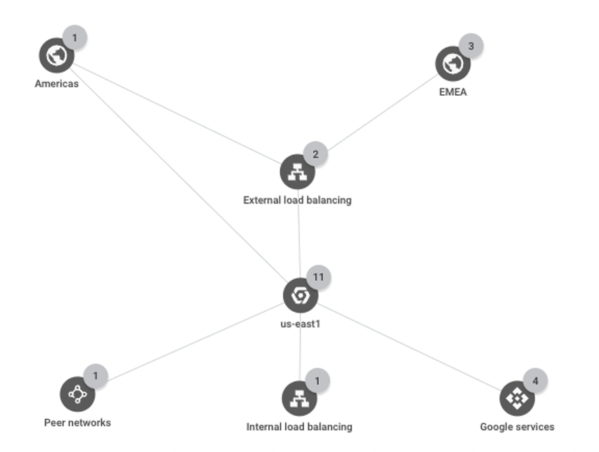

# The Infrastructure of OpenShift Deployment on GCP

With the installer and Daffy deployment options, the OpenShift cluster
is deployed in one region, and the master nodes and worker nodes of the
cluster are deployed in different zones in the same region on Google
Cloud.

## Network Topology

You can view a network topology of the deployment in your GCP project,
as shown below. The external load balancing is used to optimize network
traffic from different regions, whereas the internal load balancing is
used for internal network traffic within the OpenShift cluster.

When a Filestore instance is created, a network peering for the instance
is created automatically, enabling access between the instance and pods
in the cluster.

## Cloud Services in OpenShift Deployment

Depending on the size of the OpenShift cluster, virtual instances of
Compute Engine for master nodes and worker nodes along with persistent
disks are created. A cloud DNS is required prior to the deployment.
After the deployment, several GCP cloud services are created and
utilized, including one VPC network with two subnets, external and
internal load balancers, cloud router, internal and external IP
addresses, firewall rules, cloud routes and cloud NAT.

You can find other deployment options on GCP in [Red Hat
documentation](https://docs.openshift.com/container-platform/4.11/installing/installing_gcp/installing-restricted-networks-gcp.html),
for example, installing OpenShift into an existing VPC, installing a
private cluster, installing a cluster using Deployment Manager
templates, or installing a cluster using user provisioned infrastructure
(UPI).

## Infrastructure Architecture

The diagram below illustrates the high-level infrastructure of the
OpenShift deployment on GCP.

[Back to ReadMe page](README.MD)