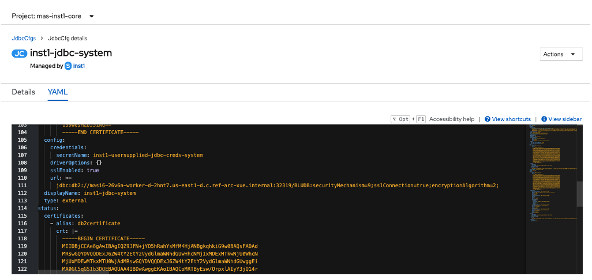

# Troubleshoot MAS Manage Activation

If you run into some issues while trying to activate MAS Manage, check the database connection and "jdbc" custom resource.

## Check the database connection string in Pods

Select project \<install instance id\>-manage from the cluster console.
Search Pods with the name "maxinst". Open the pod and a Terminal
session. Run the command line in the directory,
"/opt/IBM/SMP/maximo/tools/maximo/internal".

*./querycount.sh -qcount -tdummy_table*

In the example, we find that a ";" instead of ":" was used in the
connection string. Fix the connection string in the configuration
section on the MAS administration page.

```
jdbc:db2://\<hostname\>:32319/BLUDB**;**securityMechanism=9;sslConnection=true;encryptionAlgorithm=2;
```



## Check "ManageWorkspace" custom resource

Go to CustomResourceDefinitions under the Administration section on the
cluster console. Search "workspace". Select "ManageWorksapce". Go to the
Instances tab and select the instance named "\<install instance
id\>-\<workspace name\>". Check if the binding is set at workspace or
workspace-application and update it if necessary.\
\


## Check "jdbc" custom resource

Go to CustomResourceDefinitions under the Administration section on the
cluster console. Search "jdbc".

There are likely two resources or more in the \<install instance
id\>-core namespace, one for system and one for workspace. Open the
System resource and check the YAML detail.


